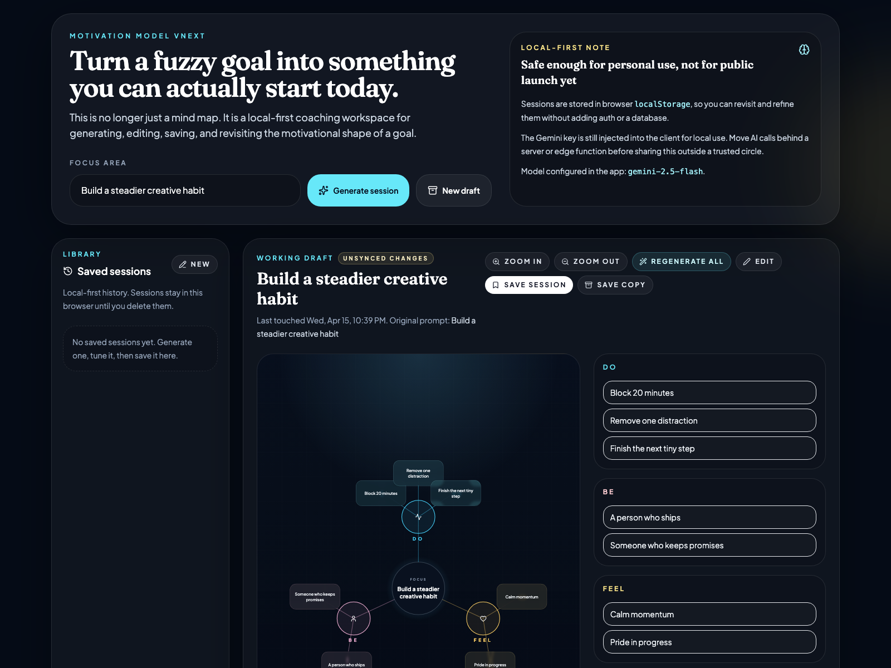

# Motivation Model Coach

一个面向个人成长场景的 `local-first` 动机教练工具。  
它的目标不是只生成一张“好看的动机图”，而是把一个模糊目标拆成一套可以立刻行动的动机方案。

## 产品预览



## 产品定位

`Motivation Model Coach` 想解决的问题是：

很多人知道自己“想做什么”，但不知道为什么总是做不下去，也不知道第一步到底该怎么迈。

这个产品把一个目标拆成三层动机结构：

- `DO`：具体要做的行为
- `BE`：这个目标在塑造怎样的身份认同
- `FEEL`：完成过程中能获得什么情绪回报

并在此基础上继续补全：

- 可能遇到的阻力
- 最小可执行的第一步
- 为什么是现在
- 一个后续复盘问题

换句话说，它不是“帮你想一个目标”，而是“帮你把目标变成更容易开始的行动系统”。

## 目标用户

当前版本更适合以下用户：

- 想做自我管理或目标拆解的个人用户
- 想把一个目标快速转成行动计划的创作者、学生、自由职业者
- 需要一个轻量 AI 辅助思考工具、但暂时不想上复杂账号系统的人

这个版本优先服务“自己用 / 小范围试用”，而不是大规模公开分发。

## 核心价值

相比只输出一组灵感词，这个版本的价值主要有四点：

1. **从模糊目标到结构化动机模型**
   输入一个目标，生成完整的动机拆解。

2. **从静态图谱到可行动建议**
   不只告诉你“为什么想做”，还告诉你“下一步能做什么”。

3. **从一次性结果到可持续迭代**
   支持手动编辑、局部再生成、保存、回看、覆盖和复制。

4. **从 Demo 到可用产品雏形**
   通过本地历史记录形成基本闭环，而不是一次性用完即走。

## 核心体验流程

当前版本的主流程是：

1. 输入一个目标或想推进的事情
2. 由 Gemini 生成一份完整的 motivation session
3. 查看图谱与结构化摘要
4. 编辑内容，或针对单个 section 局部再生成
5. 保存到本地
6. 之后继续打开、修改、覆盖或另存副本

这套流程对应的是一个产品判断：

**用户真正需要的不是“被分析一次”，而是“持续把一个目标打磨到可以做”。**

## 当前版本包含的能力

- 单次输入生成完整动机会话
- `DO / BE / FEEL` 三层结构可视化
- `obstacles / firstAction / whyNow / reflectionPrompt` 结构化输出
- 所有字段可手动编辑
- 单个 section 可局部再生成
- 本地历史记录
- 已保存会话的重新打开、更新、复制、删除
- 基础测试覆盖高风险逻辑

## 当前版本的边界

这版是一个明确受控范围的产品迭代，不追求一次做全。

### 已刻意不做的事

- 账号系统
- 云端同步
- 多人协作
- 公开分享链接
- 服务端持久化
- 面向大规模用户的正式部署方案

### 重要限制

当前 Gemini API Key 仍然注入在前端，仅适合本地使用或可信小范围试用。

如果要把这个项目公开上线，下一步必须先把 AI 请求迁到服务端或边缘函数，再考虑开放访问。

## 为什么采用 local-first

这一版选择 `local-first`，是一个刻意的产品取舍：

- 让产品先验证“是否真的有使用闭环”
- 不在早期被账号、数据库、权限系统拖慢
- 降低实现复杂度，快速迭代核心体验
- 更适合个人工具和小范围试用阶段

这意味着当前版本更像“高完成度原型 + 可用工具”，而不是完整 SaaS。

## 技术实现概览

### 技术栈

- React 19
- TypeScript
- Vite
- `@google/genai`
- `framer-motion`
- `lucide-react`
- Tailwind（通过 `index.html` 中的 CDN 配置）

### 目录结构

```text
.
├── App.tsx
├── components/
│   ├── DiagramView.tsx
│   ├── EditPanel.tsx
│   ├── HistoryPanel.tsx
│   └── Icons.tsx
├── lib/
│   ├── session-storage.ts
│   └── session-utils.ts
├── services/
│   └── geminiService.ts
├── tests/
│   ├── index-html.test.ts
│   ├── session-storage.test.ts
│   └── session-utils.test.ts
├── types.ts
└── assets/
    └── motivation-model-vnext.png
```

### 数据结构

每个保存的 session 目前包含：

- `topic`
- `sourcePrompt`
- `doItems`
- `beItems`
- `feelItems`
- `obstacles`
- `firstAction`
- `whyNow`
- `reflectionPrompt`
- `updatedAt`

持久化方式为浏览器本地 `localStorage`。

## 本地启动方式

### 环境要求

- Node.js 20+
- Gemini API Key

### 安装依赖

```bash
npm install
```

### 配置环境变量

在项目根目录创建 `.env.local`：

```bash
GEMINI_API_KEY=your_key_here
```

### 启动开发环境

```bash
npm run dev
```

### 常用脚本

```bash
npm run dev
npm test
npm run typecheck
npm run build
```

## 测试说明

当前自动化测试重点覆盖的是最容易出问题的核心逻辑：

- Gemini 返回结果到 session 数据的归一化
- 本地存储的读取、更新和删除
- `index.html` 是否正确挂载 React 入口

运行方式：

```bash
npm test
```

## 后续演进方向

如果继续往产品化推进，比较自然的下一步包括：

- 服务端代理 Gemini 请求，解决前端暴露 API Key 的问题
- 增加分享卡片或导出能力
- 优化移动端体验
- 增加更完整的复盘 / journaling 流程
- 支持多个 session 的对比查看
- 逐步从本地工具演进到可部署产品

## License

当前仓库还没有提供 License 文件。  
如果后续打算开源或开放复用，建议补充明确的许可证说明。
